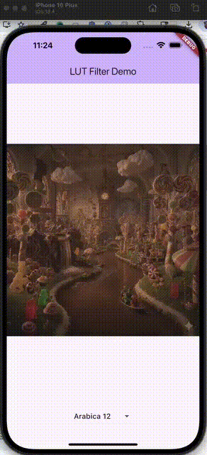

# LUTs Example

A Flutter example of using [LUTs](https://en.wikipedia.org/wiki/Lookup_table) 
for photo filters.  This was created as a demonstration of the new high bit 
depth texture support for fragment shaders in Flutter.

## Description

This demo shows how one can use the new high bit-depth texture support
in Flutter 3.41 to implement color look-up tables (LUTs) for photo filters.

Previous to Flutter 3.41, one could only use 8-bit textures attached
to fragment shaders.  The industry standard for defining LUTs is 32-bit float
textures as can be seen in files like [Arabica%2012.CUBE](assets/luts/Arabica%2012.CUBE)
, so that would have resulted in considerable loss of precision.

The transform works by treating each color in an image as a point in 3D space
and finding the nearest-neighbor in the 3D texture defined by the LUT. Flutter
and certain platforms don't have support for 3D textures so we flatten the 3D
texture into a 2D texture by slicing it up and laying it out in a 2D grid.

## Getting Started

This demo requires Flutter version >= 3.41 or the `main` channel.

```shell
# Regenerate the platform files
flutter create --no-overwrite .
fluter run
```

## New APIs from Flutter 3.41 used

- [decodeImageFromPixelsSync](https://github.com/flutter/flutter/blob/f3c54a697e45e9bcc9104912d4a7664982a2b4ee/engine/src/flutter/lib/ui/painting.dart#L2753) - A synchronous version of
`decodeImageFromPixels`.
- [PixelFormat.rgbaFloat32](https://github.com/flutter/flutter/blob/f3c54a697e45e9bcc9104912d4a7664982a2b4ee/engine/src/flutter/lib/ui/painting.dart#L1912) - A 32-bit float RGBA pixel
format.  This was previously available but now works with
`decodeImageFromPixelsSync`. [TargetPixelFormat.rgbaFloat32](https://github.com/flutter/flutter/blob/f3c54a697e45e9bcc9104912d4a7664982a2b4ee/engine/src/flutter/lib/ui/painting.dart#L1925)
is used in other API calls.
- [FragmentShader.getImageSampler](https://github.com/flutter/flutter/blob/37f698a5b5a3ddc83bc481a7394487a390617c38/engine/src/flutter/lib/ui/painting.dart#L5840)
and [FragmentShader.getUniformFloat](https://github.com/flutter/flutter/blob/37f698a5b5a3ddc83bc481a7394487a390617c38/engine/src/flutter/lib/ui/painting.dart#L5766)
\- Experimental APIs for accessing shader uniforms by name.  These are
disabled by default since the Vulkan backend isn't implemetned yet as of
Flutter 3.41.0

## Screenshot



## Acknowledgements

- LUTs from [Pond5](https://blog.pond5.com/78810-35-free-luts-for-color-grading-videos/)
- Image supplied from [Nano Banana](https://gemini.google.com)
